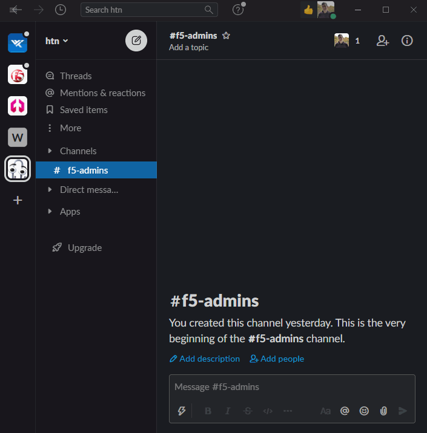

# F5 FAST Slack Bot

An experiment around consuming F5 FAST templates as the source for Slack bot modals.



## Instructions

These instructions walk through the process of deploying the Slack bot to your local system and providing Slack a means of accessing it using [Docker](https://www.docker.com) and [Ngrok](https://ngrok.com)

Alternatively, this bot can be hosted in almost any container orchestration service such as [Amazon ECS](https://aws.amazon.com/ecs/).

1. To expose the bot application to Slack, download [Ngrok](https://ngrok.com/).

2. Once Ngrok is installed, create a new Ngrok endpoint over port 8000 by running the following:
   ```
   $ ngrok http 8000
   ```

3. Download the [Slack Manifest](./slack/manifest.yml) that's provided as part of this repository and replace the **url** and **request_url** parameters with https domain provided by Ngrok.

   

4. Log into Slack, go to https://api.slack.com/apps, and click the **Create New App** button

5. Select **From an app manifest**

6. Select the Slack workspace you want to deploy the bot into and click next.

7. Copy and paste the contents from the modified manifest.yml file into the text box and click next.

8. Review the summary and click create.

9. Before closing the Slack webpage, save the **Bot User OAuth Token**. This will be used in a later step.

   

10. Create a new file called **credentials.json** with a dictionary containing the list of BIG-IP hostnames, usernames, and passwords the Slack bot will interact with.

    ```
    {
      "host1:8443": {
        "username": "admin",
        "password": "admin"
      },
      "host2:8443": {
        "username": "admin2",
        "password": "admin2"
      },
    }
    ```

11. Finally, run the bot using the following Docker command. Replace the TOKEN environment variable with the Slack OAuth token saved earlier.
    ```
    docker run \
    -p 8000:8000/tcp \
    -v "$(pwd)"/credentials.json:/opt/app/credentials.json \
    -e TOKEN=(your_bot_user_oauth_token) \
    tylerhatton/fast-slack-bot:latest
    ```

12. To access the Slack modal, type /fast in a Slack window with the workspace you installed the bot into.